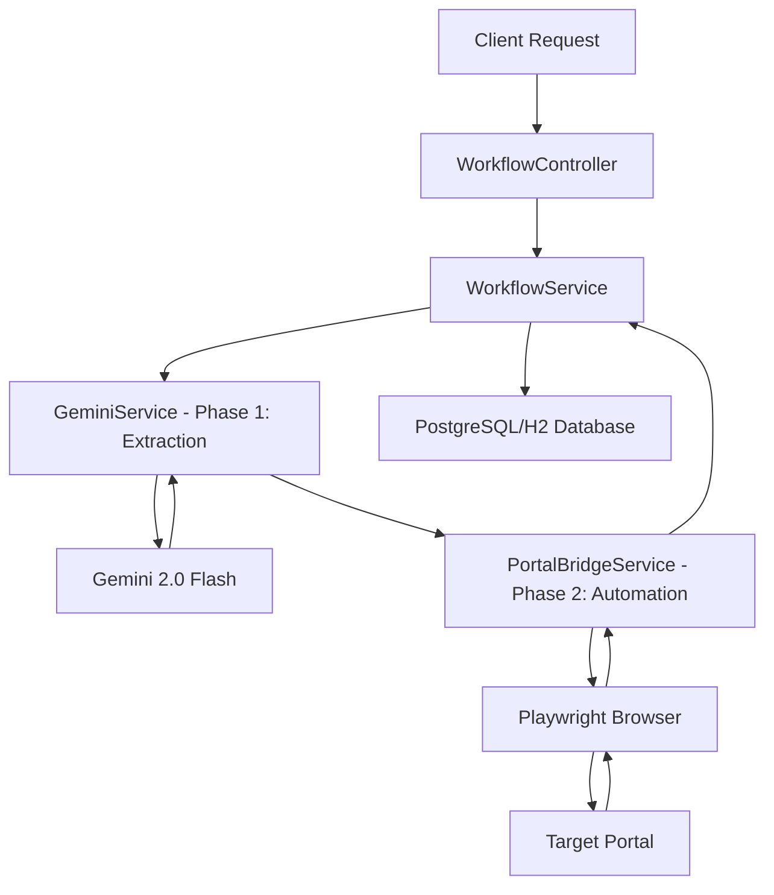

# AiLytics - AI-Powered Portal Bridge

AiLytics is a next-generation automation system that bridges the gap between unstructured document data and legacy web portals. By combining **Gemini 2.0 Flash** for document reasoning and **Playwright** for robotic browser automation, AiLytics provides a seamless "Portal Bridge" for complex business workflows.

## 🚀 Key Features
- **Multimodal Extraction**: Uses Gemini 2.0 Flash to extract structured JSON from PDFs and images.
- **Dynamic Orchestration**: Asynchronously chains data extraction and browser automation.
- **Portal Bridge**: Native browser control via Playwright to navigate, authenticate, and fill forms on third-party portals.
- **Internal Processing Queue**: High-performance job queue with configurable concurrency control.
- **Approval Gate**: Confidence-based human-in-the-loop verification for extractions.
- **Self-Healing**: AI-powered selector evolution to handle portal UI changes.
- **Enterprise Identity**: Master/Staff model with JWT-secured access.
- **One-Click Retry**: Instant recovery for failed jobs using existing data.

---

## 🏗️ Architecture



1.  **Extraction Phase**: Gemini analyzes the uploaded document and maps it to a specific JSON schema defined in the `ActionConfig`.
2.  **Automation Phase**: Playwright launches a headless browser, logs into the portal, fills the forms using the extracted data, and captures the final transaction ID.

---

## 🛠️ API Documentation

### 1. Process Document
Trigger a full extraction and automation workflow.
- **Endpoint**: `POST /api/v1/process`
- **Content-Type**: `multipart/form-data`
- **Parameters**:
  - `file`: The PDF or Image document.
  - `action`: Name of the predefined action (e.g., `MEDISEP`).
  - `username`: Portal login username.
  - `password`: Portal login password.

###  checks Status
Retrieve the status and captured result ID of a workflow.
- **Endpoint**: `GET /api/v1/status/{workflowId}`

---

## 📖 API Documentation (Swagger UI)
AiLytics comes with built-in interactive API documentation.
- **Swagger UI**: [http://76.13.143.193:8081/swagger-ui.html](http://76.13.143.193:8081/swagger-ui.html)
- **OpenAPI Spec**: [http://76.13.143.193:8081/v3/api-docs](http://76.13.143.193:8081/v3/api-docs)

---

## ⚙️ Configuration
The application can be configured via environment variables or by modifying `src/main/resources/application.yml`.

### Server Port
The default port is **8081**.

### Deployment & Tools
- **Build Tool**: The system uses global `mvn` (Maven) for builds and execution.
- **Port**: Accessible via port `8081` (Firewall must be open).

### Debug Mode (Developer Feature)
To enable visual debugging (video recording and step-by-step screenshots):
1. Set `playwright.debug-mode: true` in `application.yml`.
2. Videos are saved to `debug/videos/{jobId}`.
3. Screenshots are saved to `debug/screenshots/{jobId}`.
4. View playback directly in the Enterprise Dashboard.

### Database
The application supports PostgreSQL and H2 (In-Memory).
- **Default**: H2 for instant local testing.
- **Production**: PostgreSQL.

### Webhooks
Broadcasting job events:
- `WEBHOOK_URLS`: Comma-separated list of URLs to receive `JOB_COMPLETED` or `JOB_FAILED` payloads.

---

## 🚀 Getting Started
1. Clone the repository.
2. Install Java 21.
3. Set your `GEMINI_API_KEY`.
4. Run `mvn spring-boot:run`.

Build with ❤️ by Pi for JD.

---

## 🚀 How to Run

### 1. Prerequisites
- **Java 21** or higher.
- **Maven** (installed globally).
- **Google AI Studio API Key** (for Gemini).

### 2. Install Playwright Browsers
Playwright requires browser binaries to be installed. Run:
```bash
mvn exec:java -e -D exec.mainClass=com.microsoft.playwright.CLI -D exec.args="install --with-deps chromium"
```

### 3. Run the Application
```bash
mvn spring-boot:run
```

### 4. Access Sarah's Dashboard
Open your browser to:
`http://76.13.143.193:8081/index.html`

### 5. Test with cURL
Example request for the MEDISEP action:
```bash
curl -X POST http://76.13.143.193:8081/api/v1/process \
  -H "Authorization: Bearer YOUR_JWT_TOKEN" \
  -F "file=@/path/to/your/document.pdf" \
  -F "action=MEDISEP" \
  -F "username=your_portal_user" \
  -F "password=your_portal_pass"
```
