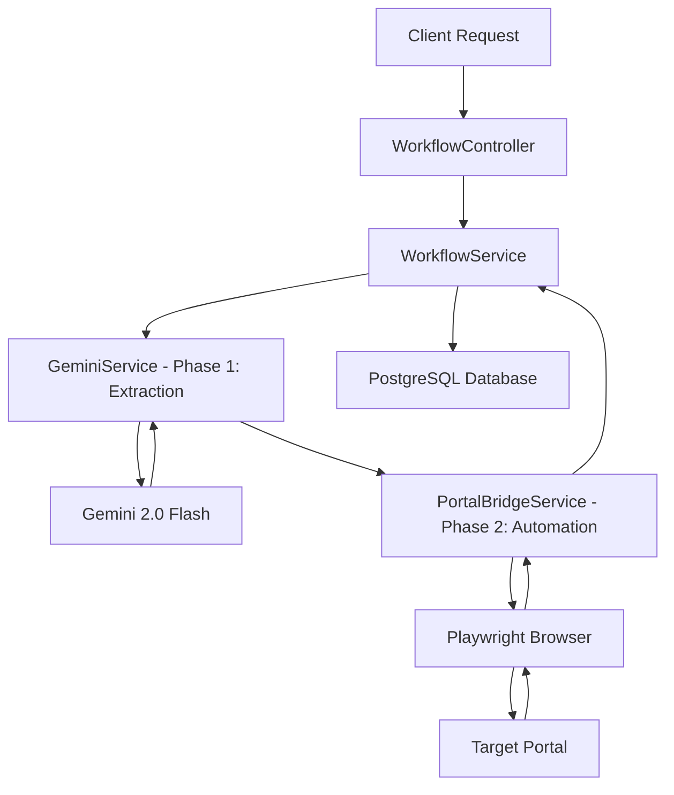

# AiLytics - AI-Powered Portal Bridge

AiLytics is a next-generation automation system that bridges the gap between unstructured document data and legacy web portals. By combining **Gemini 2.0 Flash** for document reasoning and **Playwright** for robotic browser automation, AiLytics provides a seamless "Portal Bridge" for complex business workflows.

## 🚀 Key Features
- **Multimodal Extraction**: Uses Gemini 2.0 Flash to extract structured JSON from PDFs and images.
- **Dynamic Orchestration**: Asynchronously chains data extraction and browser automation.
- **Portal Bridge**: Native browser control via Playwright to navigate, authenticate, and fill forms on third-party portals.
- **Internal Processing Queue**: PostgreSQL-backed job queue with configurable concurrency control.
- **Approval Gate**: confidence-based human-in-the-loop verification for extractions.
- **Self-Healing**: AI-powered selector evolution to handle portal UI changes.
- **Webhook Hub**: Real-time notifications for job completion and failure events.
- **Future-Proof**: Built on Spring AI abstractions, ready for Gemini 2.5 Flash on day one.

---

## 🏗️ Architecture



1.  **Extraction Phase**: Gemini analyzes the uploaded document and maps it to a specific JSON schema defined in the `ActionConfig`.
2.  **Automation Phase**: Playwright launches a headless browser, logs into the portal, fills the forms using the extracted data, and captures the final transaction ID.

---

## 🛠️ API Documentation

### 1. Process Document
Trigger a full extraction and automation workflow.
- **Endpoint**: `POST /api/v1/process`
- **Content-Type**: `multipart/form-data`
- **Parameters**:
  - `file`: The PDF or Image document.
  - `action`: Name of the predefined action (e.g., `MEDISEP`).
  - `username`: Portal login username.
  - `password`: Portal login password.

### 2. Check Status
Retrieve the status and captured result ID of a workflow.
- **Endpoint**: `GET /api/v1/status/{workflowId}`

---

## 📖 API Documentation (Swagger UI)
AiLytics comes with built-in interactive API documentation.
- **Swagger UI**: [http://localhost:8080/swagger-ui.html](http://localhost:8080/swagger-ui.html)
- **OpenAPI Spec**: [http://localhost:8080/v3/api-docs](http://localhost:8080/v3/api-docs)

---

## ⚙️ Configuration
The application can be configured via environment variables or by modifying `src/main/resources/application.yml`.

### Database (PostgreSQL)
Ensure you have a PostgreSQL instance running and set the following:
- `DB_HOST`: Database host (default: localhost).
- `DB_PORT`: Database port (default: 5432).
- `DB_NAME`: Database name (default: ailytics).
- `DB_USERNAME`: Database username (default: postgres).
- `DB_PASSWORD`: Database password.

### Webhooks
Broadcasting job events:
- `WEBHOOK_URLS`: Comma-separated list of URLs to receive `JOB_COMPLETED` or `JOB_FAILED` payloads.

### Adding New Actions
To add a new portal action, create an `ActionConfig` record in the database or update `MetadataService.java`:
- `actionName`: Unique ID for the workflow.
- `portalUrl`: The URL where the form is located.
- `extractionSchema`: JSON schema for Gemini extraction.
- `formSelectors`: Map of field names to CSS selectors on the portal.

---

## 📁 Repository Structure
- `src/main/java/com/ailytics/ailytics/service`: Core business logic (Gemini, Playwright, Workflow).
- `src/main/java/com/ailytics/ailytics/model`: JPA Entities for configurations and results.
- `src/main/java/com/ailytics/ailytics/controller`: REST API endpoints.

---

## 🚀 Getting Started
1. Clone the repository.
2. Install Java 21.
3. Set your `GEMINI_API_KEY`.
4. Run `./mvnw spring-boot:run`.

Build with ❤️ by Pi for JD.

---

## 🚀 How to Run

### 1. Prerequisites
- **Java 21** or higher.
- **Maven** (or use the included `./mvnw`).
- **PostgreSQL** instance.
- **Google AI Studio API Key** (for Gemini).

### 2. Database Setup
Create a database named `ailytics` in your PostgreSQL instance.

### 3. Environment Variables
Set the following environment variables:
```bash
export GEMINI_API_KEY=your_gemini_api_key_here
export DB_HOST=localhost
export DB_PORT=5432
export DB_NAME=ailytics
export DB_USERNAME=postgres
export DB_PASSWORD=your_password_here
```

### 4. Install Playwright Browsers
Playwright requires browser binaries to be installed. Run:
```bash
mvn exec:java -e -D exec.mainClass=com.microsoft.playwright.CLI -D exec.args="install --with-deps chromium"
```

### 5. Run the Application
```bash
./mvnw spring-boot:run
```

### 6. Test with cURL
Example request for the MEDISEP action:
```bash
curl -X POST http://localhost:8080/api/v1/process \
  -F "file=@/path/to/your/document.pdf" \
  -F "action=MEDISEP" \
  -F "username=your_portal_user" \
  -F "password=your_portal_pass"
```
Check status:
```bash
curl http://localhost:8080/api/v1/status/{workflowId}
```

---

## 🧪 Quick Start: Testing the Workflow

To help you test AiLytics immediately, we've pre-configured a `CONTACT_US` action that targets a standard demo contact form.

### 1. The Scenario
We have a document (e.g., a handwritten note) that Gemini will extract into this schema:
```json
{
  "fullName": "John Doe",
  "emailAddress": "john.doe@example.com",
  "subject": "Inquiry about Services",
  "message": "Hello, I am interested in your AI-powered automation solutions."
}
```

### 2. Trigger the Workflow
Run this `curl` command (replace `/path/to/demo.pdf` with any sample file and set your `GEMINI_API_KEY` in the environment):

```bash
curl -X POST http://localhost:8080/api/v1/process \
  -F "file=@/path/to/demo.pdf" \
  -F "action=CONTACT_US" \
  -F "username=demo_user" \
  -F "password=demo_pass"
```

### 3. What Happens Next?
1. **Extraction**: Gemini 2.0 Flash reads your PDF and extracts the contact details.
2. **Navigation**: Playwright opens a browser and navigates to the contact form.
3. **Semantic Fill**: The engine finds fields labeled "Full Name", "Email Address", "Subject", and "Message" and fills them.
4. **Submission**: The engine clicks the "Send" button.

### 4. Verify Results
Check the status of your job:
```bash
curl http://localhost:8080/api/v1/status/{jobId}
```
You should see the status transition from `PENDING` → `PROCESSING` → `COMPLETED`.
