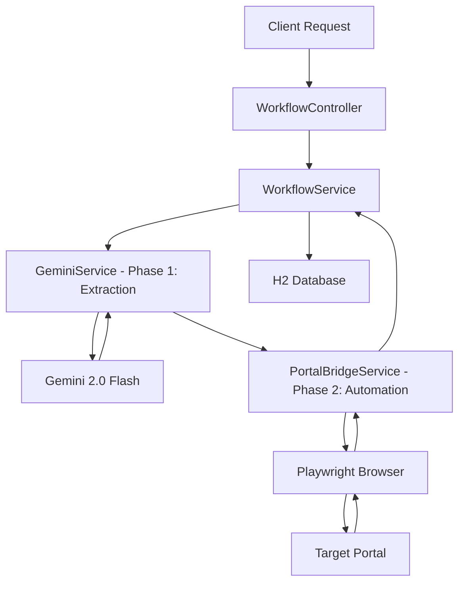

# AiLytics - AI-Powered Portal Bridge

AiLytics is a next-generation automation system that bridges the gap between unstructured document data and legacy web portals. By combining **Gemini 2.0 Flash** for document reasoning and **Playwright** for robotic browser automation, AiLytics provides a seamless "Portal Bridge" for complex business workflows.

## 🚀 Key Features
- **Multimodal Extraction**: Uses Gemini 2.0 Flash to extract structured JSON from PDFs and images.
- **Dynamic Orchestration**: Asynchronously chains data extraction and browser automation.
- **Portal Bridge**: Native browser control via Playwright to navigate, authenticate, and fill forms on third-party portals.
- **Persistence**: H2-backed database for action configurations and workflow results.
- **Future-Proof**: Built on Spring AI abstractions, ready for Gemini 2.5 Flash on day one.

---

## 🏗️ Architecture

1.  **Extraction Phase**: Gemini analyzes the uploaded document and maps it to a specific JSON schema defined in the `ActionConfig`.
2.  **Automation Phase**: Playwright launches a headless browser, logs into the portal, fills the forms using the extracted data, and captures the final transaction ID.

---

## 🛠️ API Documentation

### 1. Process Document
Trigger a full extraction and automation workflow.
- **Endpoint**: `POST /api/v1/process`
- **Content-Type**: `multipart/form-data`
- **Parameters**:
  - `file`: The PDF or Image document.
  - `action`: Name of the predefined action (e.g., `MEDISEP`).
  - `username`: Portal login username.
  - `password`: Portal login password.

### 2. Check Status
Retrieve the status and captured result ID of a workflow.
- **Endpoint**: `GET /api/v1/status/{workflowId}`

---

## ⚙️ Configuration

### Environment Variables
Set the following variables in your environment or `application.properties`:
- `GEMINI_API_KEY`: Your Google AI Studio API Key.
- `spring.ai.google.gemini.chat.options.model`: Defaults to `gemini-2.0-flash`. Set to `gemini-2.5-flash` when released.

### Adding New Actions
To add a new portal action, create an `ActionConfig` record in the database or update `MetadataService.java`:
- `actionName`: Unique ID for the workflow.
- `portalUrl`: The URL where the form is located.
- `extractionSchema`: JSON schema for Gemini extraction.
- `formSelectors`: Map of field names to CSS selectors on the portal.

---

## 📁 Repository Structure
- `src/main/java/com/ailytics/ailytics/service`: Core business logic (Gemini, Playwright, Workflow).
- `src/main/java/com/ailytics/ailytics/model`: JPA Entities for configurations and results.
- `src/main/java/com/ailytics/ailytics/controller`: REST API endpoints.

---

## 🚀 Getting Started
1. Clone the repository.
2. Install Java 21.
3. Set your `GEMINI_API_KEY`.
4. Run `./mvnw spring-boot:run`.

Build with ❤️ by Oksy for JD.
